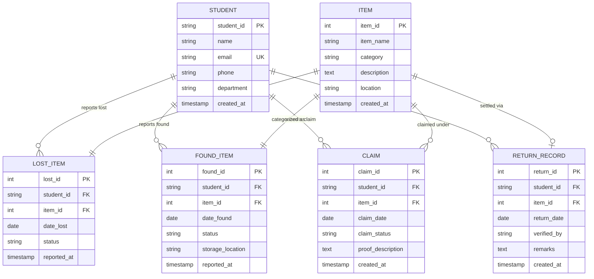

# Database Systems Lab — Project Proposal & Review 1 Report (50% Milestone)

---

## **Project Title:** Campus Lost & Found System
**Course:** Database Systems Lab (DBMS)  
**Milestone:** Review 1 (50% Progress Demonstration)  
**Academic Year:** 2026–2027  

### **Team Members:**
1. **Sritosh Rath** — Reg. No: `24BDS0001` (B.Tech Data Science)
2. **Jayant Sharma** — Reg. No: `24BAI0148` (B.Tech Artificial Intelligence)

---

## 1. Introduction & Background
The **Campus Lost & Found System** is a centralized, relational database-driven web platform designed to streamline and automate the reporting, searching, claiming, and returning of items misplaced across a university campus. In large university environments with thousands of students, faculty, and visitors across multiple academic blocks, libraries, cafeterias, and sports arenas, items like ID cards, gadgets, stationery, notebooks, keys, and accessories are frequently lost.

Traditionally, lost and found inquiries are handled manually via security desks or fragmented social media messages, leading to low recovery rates, lack of accountability, and zero tracking. This project solves that problem with a normalized, secure relational database backend paired with an intuitive interface.

---

## 2. Problem Statement
- Students regularly misplace valuable items across various campus zones (e.g., Central Library, Labs, Food Courts, Hostels, Sports Complex).
- There is no single source of truth to check whether a found item has been turned in.
- Security and administrative staff lack an auditable ledger to verify rightful ownership and record verified handovers.
- Existing manual processes cause item accumulation, delayed returns, and potential misplacement of unclaimed articles.

---

## 3. Objectives
1. **Student Registration & Profiles:** Maintain verified student contact and department information.
2. **Atomic Item Logging:** Store lost item reports and found item custody records linked to reporting students.
3. **Multi-Condition Search & Filters:** Allow instantaneous querying of records by category, location, status, and keyword.
4. **Ownership Claim Lifecycle:** Record student claim requests with proof descriptions and track verification decisions (`Pending`, `Approved`, `Rejected`).
5. **Settlement & Audit Ledger:** Record official returns with verification officer notes and timestamped return receipts.

---

## 4. Scope of the Project

### **Included in Scope:**
- Student registration and contact details management.
- Reporting of lost items with timestamps and location coordinates.
- Reporting of found items with physical security storage locations.
- Search and filtering across all lost/found inventories.
- Ownership claim submission, approval, and rejection workflow.
- Settlement recording in `RETURN_RECORD` with referential integrity enforcement.
- Live SQL query execution and database schema inspection.

### **Excluded (Out of Scope for Review 1):**
- Online payment/reward processing.
- Real-time GPS beacon tracking.
- Computer vision-based automatic image matching.

---

## 5. Database Selection & Justification
- **Database Engine:** MySQL 8.0+ / MariaDB (with embedded SQLite engine for zero-setup local demonstration).
- **Paradigm:** Relational Database Management System (RDBMS).
- **Justification:**
  1. **Strict Referential Integrity:** Foreign key constraints (`ON DELETE CASCADE`, `ON DELETE RESTRICT`) ensure orphan records are prevented.
  2. **ACID Transactions:** Ensuring multi-table atomic operations (e.g., approving a claim simultaneously updates found item status and rejects conflicting claims).
  3. **Structured Query Language (SQL):** Standardized, expressive syntax for joins, views, aggregations, and subqueries.
  4. **Data Normalization:** Elimination of redundancies through 3NF schema decomposition.

---

## 6. Entity-Relationship (ER) Design

### **Entities:**
1. **STUDENT:** Represents registered university students.
2. **ITEM:** Master entity storing generic item attributes (Name, Category, Description, Location).
3. **LOST_ITEM:** Weak/Associative entity capturing the reporting of a lost item by a student.
4. **FOUND_ITEM:** Captures found item events reported by a finder student and custody storage.
5. **CLAIM:** Represents ownership verification claims filed by students against found items.
6. **RETURN_RECORD:** Transaction record finalizing the handover of an item to its verified owner.

### **ER Diagram (Mermaid Representation):**


---

## 7. Relational Schema & Constraints

```text
STUDENT (student_id [PK], name, email [UQ], phone, department, created_at)
ITEM (item_id [PK], item_name, category, description, location, created_at)
LOST_ITEM (lost_id [PK], student_id [FK -> STUDENT.student_id], item_id [FK -> ITEM.item_id], date_lost, status, reported_at)
FOUND_ITEM (found_id [PK], student_id [FK -> STUDENT.student_id], item_id [FK -> ITEM.item_id], date_found, status, storage_location, reported_at)
CLAIM (claim_id [PK], student_id [FK -> STUDENT.student_id], item_id [FK -> ITEM.item_id], claim_date, claim_status, proof_description, created_at)
RETURN_RECORD (return_id [PK], student_id [FK -> STUDENT.student_id], item_id [FK -> ITEM.item_id], return_date, verified_by, remarks, created_at)
```

### **Integrity Constraints & Keys:**
- **Primary Keys (PK):** Uniquely identify tuples in each relation (`student_id`, `item_id`, `lost_id`, `found_id`, `claim_id`, `return_id`).
- **Unique Constraints (UQ):** `STUDENT(email)` ensures no duplicate student accounts exist.
- **Foreign Keys (FK):**
  - `LOST_ITEM.student_id` $\rightarrow$ `STUDENT.student_id` (`ON DELETE CASCADE`, `ON UPDATE CASCADE`)
  - `LOST_ITEM.item_id` $\rightarrow$ `ITEM.item_id` (`ON DELETE CASCADE`, `ON UPDATE CASCADE`)
  - `FOUND_ITEM.student_id` $\rightarrow$ `STUDENT.student_id` (`ON DELETE CASCADE`, `ON UPDATE CASCADE`)
  - `FOUND_ITEM.item_id` $\rightarrow$ `ITEM.item_id` (`ON DELETE CASCADE`, `ON UPDATE CASCADE`)
  - `CLAIM.student_id` $\rightarrow$ `STUDENT.student_id` (`ON DELETE CASCADE`, `ON UPDATE CASCADE`)
  - `CLAIM.item_id` $\rightarrow$ `ITEM.item_id` (`ON DELETE CASCADE`, `ON UPDATE CASCADE`)
  - `RETURN_RECORD.student_id` $\rightarrow$ `STUDENT.student_id` (`ON DELETE RESTRICT`, `ON UPDATE CASCADE`)
  - `RETURN_RECORD.item_id` $\rightarrow$ `ITEM.item_id` (`ON DELETE RESTRICT`, `ON UPDATE CASCADE`)
- **Domain/Check Constraints:**
  - `LOST_ITEM.status IN ('Pending', 'Claimed', 'Returned', 'Cancelled')`
  - `FOUND_ITEM.status IN ('Pending', 'Claimed', 'Returned')`
  - `CLAIM.claim_status IN ('Pending', 'Approved', 'Rejected', 'Returned')`

---

## 8. Database Normalization Analysis (1NF, 2NF, 3NF)

### **A. First Normal Form (1NF)**
- **Definition:** A relation is in 1NF if and only if all attribute domains contain only atomic (indivisible) values, and there are no repeating groups or arrays.
- **Compliance:**
  - Every column (e.g., `phone`, `category`, `location`) holds single atomic values.
  - Multi-valued attributes (e.g., multiple claims for an item) are separated into individual tuples in the `CLAIM` table rather than comma-separated lists.
  - Each table has a defined primary key.

### **B. Second Normal Form (2NF)**
- **Definition:** A relation is in 2NF if it is in 1NF and every non-prime attribute is fully functionally dependent on the primary key (i.e., no partial dependencies where an attribute depends on part of a composite key).
- **Compliance:**
  - All relations in our schema utilize single-attribute surrogate or natural primary keys:
    - `STUDENT`: Primary key is `{student_id}`
    - `ITEM`: Primary key is `{item_id}`
    - `LOST_ITEM`: Primary key is `{lost_id}`
    - `FOUND_ITEM`: Primary key is `{found_id}`
    - `CLAIM`: Primary key is `{claim_id}`
    - `RETURN_RECORD`: Primary key is `{return_id}`
  - Since no composite candidate keys exist, partial functional dependencies are mathematically eliminated.

### **C. Third Normal Form (3NF)**
- **Definition:** A relation is in 3NF if it is in 2NF and there are no transitive functional dependencies (i.e., for every non-trivial functional dependency $X \rightarrow Y$, either $X$ is a superkey or $Y$ is a prime attribute).
- **Compliance:**
  - In `LOST_ITEM`, non-prime attributes are `{date_lost, status}`. These depend directly on `{lost_id}`. Student attributes (such as student name, department, phone) are **not** stored in `LOST_ITEM`; instead, only the foreign key `student_id` is maintained.
  - In `CLAIM`, `proof_description` and `claim_date` depend only on `claim_id`.
  - In `RETURN_RECORD`, `verified_by` and `remarks` depend directly on `return_id`.
  - Thus, no transitive dependencies ($PK \rightarrow Non\text{-}Key \rightarrow Non\text{-}Key$) exist across the schema.

---

## 9. Data Dictionary

### Table 1: `STUDENT`
| Field Name | Data Type | Key / Constraint | Description |
| :--- | :--- | :--- | :--- |
| `student_id` | VARCHAR(20) | PRIMARY KEY | Unique University Registration Number |
| `name` | VARCHAR(100) | NOT NULL | Student's full name |
| `email` | VARCHAR(120) | NOT NULL, UNIQUE | University email address |
| `phone` | VARCHAR(15) | NOT NULL | Contact phone number |
| `department` | VARCHAR(50) | NOT NULL | Academic branch (e.g. Data Science, AI, CSE) |
| `created_at` | TIMESTAMP | DEFAULT CURRENT_TIMESTAMP | Registration record timestamp |

### Table 2: `ITEM`
| Field Name | Data Type | Key / Constraint | Description |
| :--- | :--- | :--- | :--- |
| `item_id` | INTEGER | PRIMARY KEY (AUTO_INCREMENT) | Unique item serial identifier |
| `item_name` | VARCHAR(150) | NOT NULL | Title / Name of the item |
| `category` | VARCHAR(50) | NOT NULL | Category (Electronics, Cards, Stationery, etc.) |
| `description`| TEXT | NULL | Identifying marks, color, scratches, stickers |
| `location` | VARCHAR(150) | NOT NULL | Specific campus spot where lost or discovered |
| `created_at` | TIMESTAMP | DEFAULT CURRENT_TIMESTAMP | Item creation timestamp |

### Table 3: `LOST_ITEM`
| Field Name | Data Type | Key / Constraint | Description |
| :--- | :--- | :--- | :--- |
| `lost_id` | INTEGER | PRIMARY KEY (AUTO_INCREMENT) | Unique lost report identifier |
| `student_id` | VARCHAR(20) | FOREIGN KEY $\rightarrow$ `STUDENT` | Reporting student's ID |
| `item_id` | INTEGER | FOREIGN KEY $\rightarrow$ `ITEM` (UNIQUE) | Associated item identifier |
| `date_lost` | DATE | NOT NULL | Date when the item was lost |
| `status` | VARCHAR(20) | CHECK (Pending, Claimed, Returned) | Current lifecycle status |
| `reported_at`| TIMESTAMP | DEFAULT CURRENT_TIMESTAMP | Timestamp when report was lodged |

### Table 4: `FOUND_ITEM`
| Field Name | Data Type | Key / Constraint | Description |
| :--- | :--- | :--- | :--- |
| `found_id` | INTEGER | PRIMARY KEY (AUTO_INCREMENT) | Unique found report identifier |
| `student_id` | VARCHAR(20) | FOREIGN KEY $\rightarrow$ `STUDENT` | Finder student's ID |
| `item_id` | INTEGER | FOREIGN KEY $\rightarrow$ `ITEM` (UNIQUE) | Associated item identifier |
| `date_found` | DATE | NOT NULL | Date when the item was discovered |
| `status` | VARCHAR(20) | CHECK (Pending, Claimed, Returned) | Custody status |
| `storage_location` | VARCHAR(100) | NOT NULL | Security office / custody cabinet |
| `reported_at`| TIMESTAMP | DEFAULT CURRENT_TIMESTAMP | Timestamp when finder turned in item |

### Table 5: `CLAIM`
| Field Name | Data Type | Key / Constraint | Description |
| :--- | :--- | :--- | :--- |
| `claim_id` | INTEGER | PRIMARY KEY (AUTO_INCREMENT) | Unique claim identifier |
| `student_id` | VARCHAR(20) | FOREIGN KEY $\rightarrow$ `STUDENT` | Claimant student ID |
| `item_id` | INTEGER | FOREIGN KEY $\rightarrow$ `ITEM` | Found item being claimed |
| `claim_date` | DATE | NOT NULL | Date claim was submitted |
| `claim_status`| VARCHAR(20) | CHECK (Pending, Approved, Rejected) | Verification decision status |
| `proof_description` | TEXT | NOT NULL | Verifiable proof details supplied by claimant |
| `created_at` | TIMESTAMP | DEFAULT CURRENT_TIMESTAMP | Submission timestamp |

### Table 6: `RETURN_RECORD`
| Field Name | Data Type | Key / Constraint | Description |
| :--- | :--- | :--- | :--- |
| `return_id` | INTEGER | PRIMARY KEY (AUTO_INCREMENT) | Unique return transaction identifier |
| `student_id` | VARCHAR(20) | FOREIGN KEY $\rightarrow$ `STUDENT` | Verified owner student ID |
| `item_id` | INTEGER | FOREIGN KEY $\rightarrow$ `ITEM` (UNIQUE) | Returned item identifier |
| `return_date` | DATE | NOT NULL | Date of physical handover |
| `verified_by` | VARCHAR(100)| NOT NULL | Authority / officer verifying handover |
| `remarks` | TEXT | NULL | Verification details and settlement notes |
| `created_at` | TIMESTAMP | DEFAULT CURRENT_TIMESTAMP | Transaction timestamp |

---

## 10. Review 1 (50% Milestone) Features vs Planned Review 2 (100%)

| Milestone 1: Review 1 (50% Completed) | Milestone 2: Review 2 (Planned 100% Scope) |
| :--- | :--- |
| ✅ Complete 3NF Database Schema (DDL) | 🔄 Image upload & storage (AWS S3 / Blob storage) |
| ✅ Full Sample Dataset (DML) with realistic data | 🔄 Automated item similarity matching algorithm |
| ✅ 6 Relational Tables with PK, FK, Constraints | 🔄 Automated email notifications to students |
| ✅ Comprehensive Analytical SQL Query Suite (Joins, Aggregations, Subqueries) | 🔄 Role-based authentication (Student vs Security Admin) |
| ✅ REST API Backend (Flask + SQLite/MySQL) | 🔄 QR Code generation for item tags |
| ✅ Full-featured interactive Web UI | 🔄 PDF Receipt generation on item handover |
| ✅ Live SQL Query Console & Schema Inspector | 🔄 Analytics charts & heatmaps of campus loss zones |

---

## 11. How to Run the Application Locally

```bash
# 1. Clone or open the project directory:
cd "c:\Users\Sritosh Rath\Desktop\dbms_project"

# 2. Launch the application (starts backend & opens UI):
python run_app.py
```
The server will start at `http://127.0.0.1:5000` and open in your default browser automatically.
